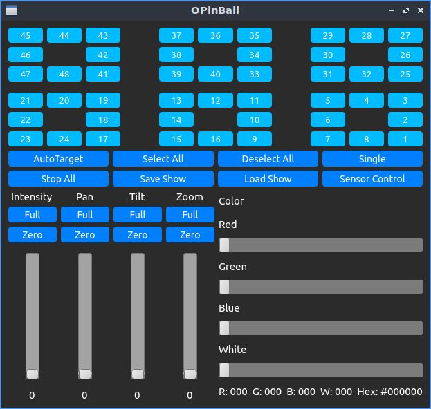

# OPinBall
**O**pen **Pin**spot for **Ball**rooms (**OPinBall**) is an open source DMX over Art-Net lighting controller designed to make it easier to pinspot centerpieces for banquet functions in ballrooms. 

## Features
- Easy fixture layout mapping.
- Aim fixtures with smartphone accelerometer.
- Save state of show for easy restoration.
- Intensity, pan, tilt, zoom, and color control.
- Experimental AutoTarget feature using a MacBook Pro's ambient light sensor.

### Fixture Layout Mapping
The file `layout.csv` contains the fixture map. Any cell with a numeric value will be treated as the location of that numbered fixture. Any cell with a non-numeric value will be treated as a spacer.

### User Configuration
Many configuration details can now be modified in `config.json`.

### Custom Fixture Profiles
Additional fixture profiles can be added to the `profiles` folder. Profiles should follow the example profile provided for the Elation ZCL-360i in extended mode. The current fixture profile is activated by the `fixtureType` setting in `config.json`.

### Smartphone Sensor Control
To use the smartphone accelerometer control feature, select a single fixture and press **Sensor Control**. Set your smartphone app to send sensor values via UDP to the computer's IP address at port **50000** and press **Start** to begin moving the fixture. Pressing **Stop** will end control.

### Ambient Light Sensor AutoTarget
To use the AutoTarget feature, place the MacBook Pro at the desired location, select a fixture, and press **AutoTarget**. The software will aim the fixture around the room while measuring the ambient light level. After completing a pass, the fixture will return to the position where the highest light level was observed, hopefully on the MacBook Pro.

## Future Improvements
- Support for additional fixture types and custom fixture profiles - **In Progress**
- Support for [Open Fixture Library](https://open-fixture-library.org) JSON format fixture profiles.
- Detailed documentation of configuration options and fixture profiles.
- Saving of slider states when switching between fixtures.
- Additional customization and configuration options - **In Progress**
- Pre-built binaries.

## Compatibility
OPinBall was written for one particular hotel ballroom that is equipped with 48 Elation ZCL-360i fixtures in Extended Mode spread across two DMX universes. Currently, it can support 48 or fewer ZCL-360i fixtures in any desired layout. Ongoing updates are improving customization and compatibility.

## Requirements
Any version of Python 3 should work. PyQt5 and Numpy are also required. Tested under macOS 10.14 Mojave and Ubuntu 20.04.

## Development
I do not have access to any other venues or fixtures with which to test OPinBall and, thanks to COVID, my access to the ballroom for which it was originally designed is limited. Any assistance with development or testing would be greatly appreciated. 

## Credits
The underlying Art-Net library is **[StupidArtnet](https://github.com/cpvalente/stupidArtnet)**.

## Disclaimer
This software is intended for use with expensive professional lighting equipment. It comes with no guarantees that it will be free from bugs or not damage equipment.